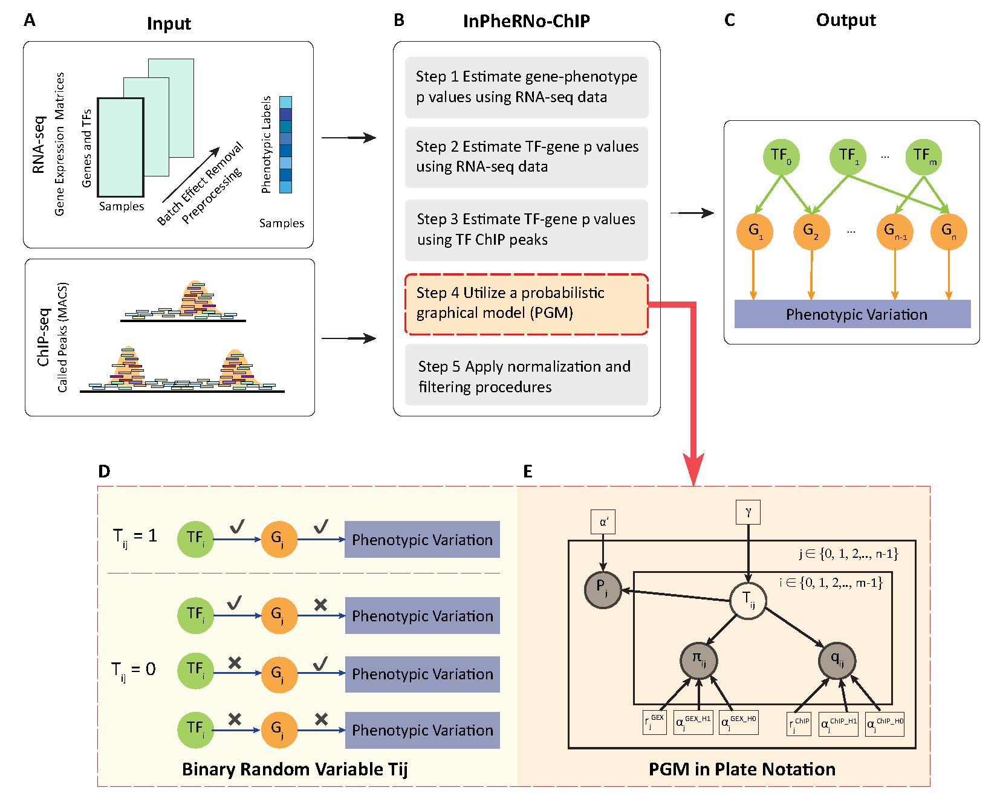

# InPheRNo-ChIP: Inference of Phenotype-relevant Regulatory Networks with ChIP-seq Integration

InPheRNo-ChIP is a computational framework designed to infer phenotype-relevant gene regulatory networks (GRNs) by integrating RNA-seq and ChIP-seq data. 



# Running InPheC
**Sequential Execution:**
- Execute the scripts InPheC_step1.py, InPheC_step2.py, and InPheC_step3.py in sequence. Each script builds on the outputs from its predecessor, so complete each step before proceeding.

**Replicating Published Results:**
- The final inferred GRN relevant to hESC-to-dEN differentiation as analyzed in the manuscript can be found at `./step3/RnCnP_vary-Tp0.0909_nc4_ni4000_nt2000_nb400_minMax.csv`.
- To replicate this GRN without the variability introduced by the Elastic Net in `InPheC_step1.py`, begin with step1 results in `./step1` and proceed with only `InPheC_step2.py` and `InPheC_step3.py`.

## Quick Start

To begin using InPheRNo-ChIP, ensure you have the following prerequisites:
- **Python 3.11.5**: The software is developed and tested with Python 3.11.5.
- **Conda Environment**: For efficient management of dependencies, using Conda is recommended. An `InPheC_Env.yml` file is included in the repository to help set up a virtual environment with all required packages.

**Inputs and Outputs**
- Inputs: Files in the "./Data" folder.
- Outputs: Final GRN file is named with prefix `RnCnP_` in the "./step3" directory.

**Setting Up and Running InPheRNo-ChIP**: Please follow these steps to clone the repository, set up the environment, and run the pipeline.

```bash
# Env set up
git clone https://github.com/TheChenSu/InPheRNo-ChIP.git
cd InPheRNo-ChIP
conda env create -f InPheC_Env.yml
conda activate inpheC

# Run the pipeline steps
python InPheC_Step1.py  
python InPheC_Step2.py  
python InPheC_Step3.py  
```
# Detailed Data Descriptions
This section offers a quick description of what InPheC expects as inputs and outputs of each step.

## InPheC_Step1.py

**Input Data:**

- **Gene Expression Data (RNA-seq):**
  - **Location:** `./Data/RNA_seq/`
  - **Input 1.1**: `RNAseq_expr_sample_gse981-gse361-gse371_voom-zScore.csv` - Provides normalized gene expression values for various samples.
  - **Input 1.2**:  `RNAseq_pval_gene-phenotype_gse361-gse981-gse371_logFC2_FDR0.01.csv` - Provides p-values indicating the association strengths between genes and specific phenotypes.
  - **Input 1.3**: `RNAseq_pval_gene-phenotype_gse361-gse981-gse371_allGenes.csv` - Provides gene-phenotype association p-values for a comprehensive set of genes.

- **ChIP-seq Data:**
  - **Location:** `./Data/ChIP_GSE61475_G/`
  - **Content Description:** The directory contains multiple `.bed.tsv` files for different TFs across two lineages: dEN and h64. Each file represents ChIP-seq binding data for a specific TF.
  - **Example Files: (Input 1.4x)**
    - `dEN_CTCF_GSM1505625_raw_pyBedTools.bed.tsv`
    - `h64_EOMES_GSM1505627_raw_pyBedTools.bed.tsv`

- **Transcription Factors List:**
  - **Input 1.5**: `mapped_hmTFs_legitTFs-HumanTFDB.csv`
  - **Purpose:** Lists TFs included in the analysis to ensure that only relevant TFs are used for constructing the regulatory network.

**Output Data:**
- **Location:** `./step1/`
- **Output 1.1**: `ChIPseq_pval_gene-tf_minQ_h64_dEN.csv` .
  - **Details:** Includes processed ChIP-seq data where only relevant TF-gene interactions are retained based on minimal p-values across peaks. 

- **Output 1.2**: `RNAseq_pval_gene-tf_intersect_chip_dEN.csv`.
  - **Details:** Contains TF-Gene associations from RNA-seq data. 

- **Output 1.3**: `RNAseq_pval_gene-pheno_intersect_chip_dEN.csv`.
  - **Details:** Updated gene-phenotype association data aligned with the results from the gene-TF association analysis to maintain consistency across analyses.

## InPheC_Step2.py
**Input Data:** (Intermediate Outputs From InPheC_Step1.py)
- Utilizes the intermediate outputs from Step 1, located in `./step1/`:
    - **Intermediate Output 1.1**: `ChIPseq_pval_gene-tf_minQ_h64_dEN.csv`
    - **Intermediate Output 1.2**: `RNAseq_pval_gene-tf_intersect_chip_dEN.csv`
    - **Intermediate Output 1.3**: `RNAseq_pval_gene-pheno_intersect_chip_dEN.csv`
- Additionally, uses **Input 1.3** from Step 1 (`RNAseq_pval_gene-phenotype_gse361-gse981-gse371_allGenes.csv`) located in `./Data/RNA_seq/`.

**Output Data:**
- **Location:** `./step2/`
- Outputs are serialized Python objects (pickles) containing the results from each batch processed. Each file corresponds to a batch and contains PGM outputs, facilitating subsequent analyses or batch-specific reviews.
    - Examples:
      - `RnCnP_vary-Tp0.0909_nc4_ni4000_nt2000_noburn_batch0.pkl`
      - `RnCnP_vary-Tp0.0909_nc4_ni4000_nt2000_noburn_batch1.pkl`
      - ... up to the last batch.
  - A sub-directory named `tmp` contains intermediate files used during processing, such as `in2pgm_woCtrl.csv`, for debugging or process validation purpose.

## InPheC_Step3.py

**Input Data:** (Intermediate Outputs From InPheC_Step2.py) 
- Utilizes all `.pkl` files from `./step2/`.

**Output Data:**
- **Location:** `./step3/`
- **Output 3.1:** `RnCnP_vary-Tp0.0909_nc4_ni4000_nt2000_nb400_minMax.csv` is the final GRN that is phenotype-relevant.

# Documentation
For detailed installation instructions, usage guides, and in-depth information on function parameters and code documentation, visit our Sphinx documentation page.

# Getting Help
For assistance with InPheRNo-ChIP, we offer 2 channels:
- **GitHub Issues**: For bug reports or feature requests, please use the [Issues section](https://github.com/TheChenSu/InPheRNo-ChIP/issues).
- **GitHub Discussions**: For general questions, ideas, or community discussions, the [Discussions section](https://github.com/TheChenSu/InPheRNo-ChIP/discussions) is the perfect place.

Your questions and feedback are invaluable to us, and we encourage you to utilize these channels to enhance your experience with InPheRNo-ChIP. 

# License
InPheRNo-ChIP

*Inference of Phenotype-relevant Regulatory Networks with ChIP-seq Integration*

Copyright (C) 2024 Chen Su, Amin Emad

This program is free software: you can redistribute it and/or modify it under the terms of the GNU Affero General Public License as published by the Free Software Foundation, either version 3 of the License, or (at your option) any later version.

This program is distributed in the hope that it will be useful, but WITHOUT ANY WARRANTY; without even the implied warranty of MERCHANTABILITY or FITNESS FOR A PARTICULAR PURPOSE. See the GNU Affero General Public License for more details.

You should have received a copy of the GNU Affero General Public License along with this program. If not, see https://www.gnu.org/licenses/.